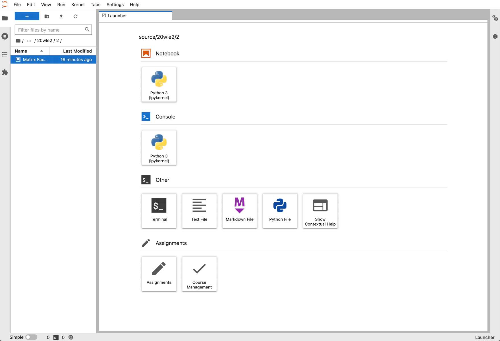

.. image:: ./docs/source/_static/assets/images/logo_name.png
   :width: 95%
   :alt: banner
   :align: center

General

.. image:: https://readthedocs.org/projects/grader-service/badge/?version=latest
    :target: https://grader-service.readthedocs.io/en/latest/?badge=latest
    :alt: Documentation Status

.. image:: https://img.shields.io/github/license/TU-Wien-dataLAB/Grader-Service
    :target: https://github.com/TU-Wien-dataLAB/Grader-Service/blob/main/LICENSE
    :alt: BSD-3-Clause

.. image:: https://img.shields.io/github/commit-activity/m/TU-Wien-dataLAB/Grader-Service
    :target: https://github.com/TU-Wien-dataLAB/Grader-Service/commits/
    :alt: GitHub commit activity

Grader Convert

.. image:: https://img.shields.io/pypi/v/grader-convert
    :target: https://pypi.org/project/grader-convert/
    :alt: PyPI

.. image:: https://img.shields.io/pypi/pyversions/grader-convert
    :target: https://pypi.org/project/grader-convert/
    :alt: PyPI - Python Version

Grader Service

.. image:: https://img.shields.io/pypi/v/grader-service
    :target: https://pypi.org/project/grader-service/
    :alt: PyPI

.. image:: https://img.shields.io/pypi/pyversions/grader-service
    :target: https://pypi.org/project/grader-service/
    :alt: PyPI - Python Version

Grader Labextension

.. image:: https://img.shields.io/pypi/v/grader-labextension
    :target: https://pypi.org/project/grader-labextension/
    :alt: PyPI

.. image:: https://img.shields.io/pypi/pyversions/grader-labextension
    :target: https://pypi.org/project/grader-labextension/
    :alt: PyPI - Python Version

.. image:: https://img.shields.io/npm/v/grader-labextension
    :target: https://www.npmjs.com/package/grader-labextension
    :alt: npm

**Disclaimer**: *Grader Service is still in the early development stages. You may encounter issues while using the service.*

Grader Service offers lecturers and students a well integrated teaching environment for data science, machine learning and programming classes.

Read the `official documentation <https://grader-service.readthedocs.io/en/latest/index.html>`_.

Requirements
===========
..

   JupyterHub,
   JupyterLab,
   Python >= 3.8,
   pip,
   Node.js>=12,
   npm

Installation
============

.. installation-start

This repository contains the packages for the jupyter extensions and the grader service as well as grader-convert.

The grader service has only been tested on Unix/macOS operating systems.

This repository contains all the necessary packages for a full installation of the grader service.

* ``grader-convert``\ : A tool for converting notebooks to different formats (e.g. removing solution code, executing, etc.). It can be used as a command line tool but will mainly be called by the service.

.. code-block::

    pip install grader-convert

* ``grader-labextension``\ : The JupyterLab plugin for interacting with the service. Provides the UI for instructors and students and manages the local git repositories for the assignments etc.

.. code-block::

    pip install grader-labextension

* ``grader-service``\ : Manages students and instructors, files, grading and multiple lectures. It can be run as a standalone containerized service and can utilize a kubernetes cluster for grading assignments.

.. code-block::

    pip install grader-service

Installation from Source
--------------------------

To install this package from source, clone into the repository or download the `zip file <https://github.com/TU-Wien-dataLAB/Grader-Service/archive/refs/heads/main.zip/>`_.

Local installation
^^^^^^^^^^^^^^^^^^^^

In the ``grader`` directory run:

.. code-block:: bash

   pip install -r ./grader_convert/requirements.txt
   pip install --no-use-pep517 ./grader_convert

   pip install -r ./grader_labextension/requirements.txt
   pip install ./grader_labextension

   pip install -r ./grader_service/requirements.txt
   pip install --no-use-pep517 ./grader_service

Then, navigate to the ``grader_labextension``\ -directory and follow the instructions in the README file.

Development Environment
^^^^^^^^^^^^^^^^^^^^^^^^

Alternatively you can run the installation scripts in ``examples/dev_environment``.
Follow the documentation there. The directory also contains the config files for a local installation.

.. installation-end

Getting Started
===============

.. running-start

Running grader service
=======================

To run the grader service you first have to register the service in JupyterHub as an unmanaged service in the config:

.. code-block:: python

    c.JupyterHub.services.append(
        {
            'name': 'grader',
            'url': 'http://127.0.0.1:4010',
            'api_token': '<token>'
        }
    )

The api token can be generated in the jupyterhub control panel.
You can verify the config by running ``jupyterhub -f <config_file.py>`` and you should see the following error message: ::

    Cannot connect to external service grader at http://127.0.0.1:4010. Is it running?

Specifying user roles
======================

Since the JupyterHub is the only source of authentication for the service, it has to rely on the JupyterHub to provide all the necessary information for user groups.

Users have to be added to specific groups which maps the users to lectures and roles. They have to be separated by colons.

The config could look like this:

.. code-block:: python

    ## generic
    c.JupyterHub.admin_access = True
    c.Spawner.default_url = '/lab'
    c.Spawner.cmd=["jupyter-labhub"]

    ## authenticator
    c.JupyterHub.authenticator_class = 'jupyterhub.auth.DummyAuthenticator'
    c.Authenticator.allowed_users = {'user1', 'user2', 'user3', 'user4'}
    c.Authenticator.admin_users = {'user1', 'user2', 'user3', 'user4'}

    ## spawner
    c.JupyterHub.spawner_class = 'jupyterhub.spawner.SimpleLocalProcessSpawner'
    c.SimpleLocalProcessSpawner.home_dir_template = '/path/to/lab_dir/{username}'

    c.JupyterHub.load_groups = {
        "lect1:instructor": ["user1"],
        "lect1:tutor": ["user2"],
        "lect1:student": ["user3", "user4"]
    }

Here, ``user1`` is an instructor of the lecture with the code ``lect1`` and so on.

Starting the service
=====================

In order to start the grader service we have to provide a configuration file for it as well:

.. code-block:: python

    import os

    c.GraderService.service_host = "127.0.0.1"
    # existing directory to use as the base directory for the grader service
    service_dir = os.path.expanduser("<grader_service_dir>")
    c.GraderService.grader_service_dir = service_dir

    c.JupyterHubGroupAuthenticator.hub_api_url = "http://127.0.0.1:8081/hub/api"

    c.LocalAutogradeExecutor.base_input_path = os.path.expanduser(os.path.join(service_dir, "convert_in"))
    c.LocalAutogradeExecutor.base_output_path = os.path.expanduser(os.path.join(service_dir, "convert_out"))

The ``<token>`` has to be the same value as the JupyterHub service token specified earlier. The ``grader_service_dir`` directory has to be an existing directory with appropriate permissions to let the grader service read and write from it.

Alternatively, you can run ``grader-service --generate-config -f /path/to/grader_service_config.py`` to generate the skeleton for the config file that show all possible configuration options.

Furthermore the database must be initialized before we can start the service.
To do this navigate to the ``grader_service_dir`` that was specified and execute the following command: ::

    grader-service-migrate

Then the grader service can be started by specifying the config file as such: ::

    grader-service -f <grader_service_config.py>

When restarting the JupyterHub you should now see the following log message: ::

    Adding external service grader at http://127.0.0.1:4010

Do not forget to set the log level to ``INFO`` in the JupyterHub config if you want to see this message.

The last thing we have to configure is the server-side of the JupyterLab plugin which also needs information where to access the endpoints of the service. This can be done in the `jupyter_notebook_config.py` file. When using the defaults from above we do not need to explicitly configure this but it would look like this:

.. code-block:: python

    import os
    c.GitService.git_access_token = os.environ.get("JUPYTERHUB_API_TOKEN")
    c.GitService.git_remote_url = "http://127.0.0.1:4010/services/grader/git"

    c.RequestService.url = "http://127.0.0.1:4010"

.. running-end

Using LTI3 Authenticator
=========================

In order to use the grader service with an LMS like Moodle, the groups first have to be added to the JupyterHub so the grader service gets the necessary information from the hub.

For this purpose, the `LTI 1.3 Authenticator <https://github.com/TU-Wien-dataLAB/lti13oauthenticator>`_ can be used so that users from the LMS can be added to the JupyterHub.

To automatically add the groups for the grader service from the LTI authenticator, the following `post auth hook <https://jupyterhub.readthedocs.io/en/stable/api/auth.html#jupyterhub.auth.Authenticator.post_auth_hook>`_ can be used.

.. code-block:: python

    from jupyterhub import orm
    import sqlalchemy

    def post_auth_hook(authenticator, handler, authentication):
        db: sqlalchemy.orm.session.Session = authenticator.db
        log = authenticator.log

        course_id = authentication["auth_state"]["course_id"].replace(" ","")
        user_role = authentication["auth_state"]["user_role"]
        user_name = authentication["name"]

        # there are only Learner and Instructors
        if user_role == "Learner":
            user_role = "student"
        elif user_role == "Instructor":
            user_role = "instructor"
        user_model: orm.User = orm.User.find(db, user_name)
        if user_model is None:
            user_model = orm.User()
            user_model.name = user_name
            db.add(user_model)
            db.commit()

        group_name = f"{course_id}:{user_role}"
        group = orm.Group.find(db, group_name)
        if group is None:
            log.info(f"Creating group: '{group_name}'")
            group = orm.Group()
            group.name = group_name
            db.add(group)
            db.commit()

        extra_grader_groups = [g for g in user_model.groups if g.name.startswith(f"{course_id}:") and g.name != group_name]
        for g in extra_grader_groups:
            log.info(f"Removing user from group: {g.name}")
            g.users.remove(user_model)
            db.commit()

        if user_model not in group.users:
            log.info(f"Adding user to group: {group.name}")
            group.users.append(user_model)
            db.commit()

        return authentication

Make sure that the ``course_id`` does not contain any spaces or special characters!
