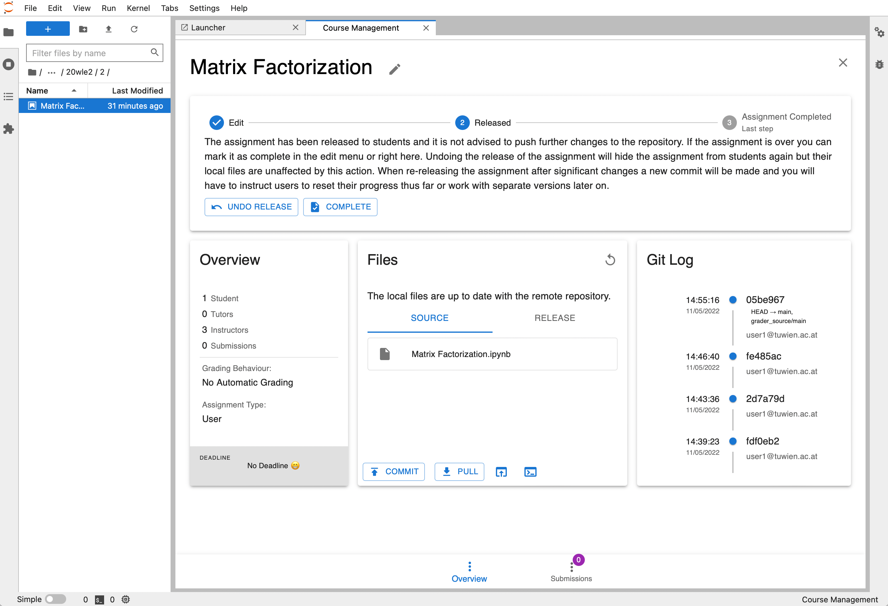

Grader Labextension
####################

The JupyterLab extension consists of two launchers for students and instructors/tutors.

Course Management
-----------------

The `Course Management` view for instructors and tutors provides functionality to create and manage assignments in lectures.
The whole lifecycle of the assignment is managed in this view, including the grading procedure.

Assignment
-----------

Students can view their assignments in the `Assignment` view and after working on the assignment they can make a submission
which will become visible in the `Submissions` tab in the `Course Management` view.

.. image:: ../_static/assets/images/student_view.png

.. View the `REST API <./grader_labextension_rest_api.html>`_ of the extension here.

REST API Documentation
-----------------------

.. toctree::
   :maxdepth: 4

   grader_labextension_rest_api

Subpackages
-----------

.. toctree::
   :maxdepth: 4

   grader_labextension.api
   handlers/handlers
   grader_labextension.services

Submodules
----------

Handlers
------------------------------------

.. automodule:: grader_labextension.handlers
   :members:
   :undoc-members:
   :show-inheritance:

Registry
------------------------------------

.. automodule:: grader_labextension.registry
   :members:
   :undoc-members:
   :show-inheritance:

..
    Module contents
    ---------------

    .. automodule:: grader_labextension
       :members:
       :undoc-members:
       :show-inheritance:
