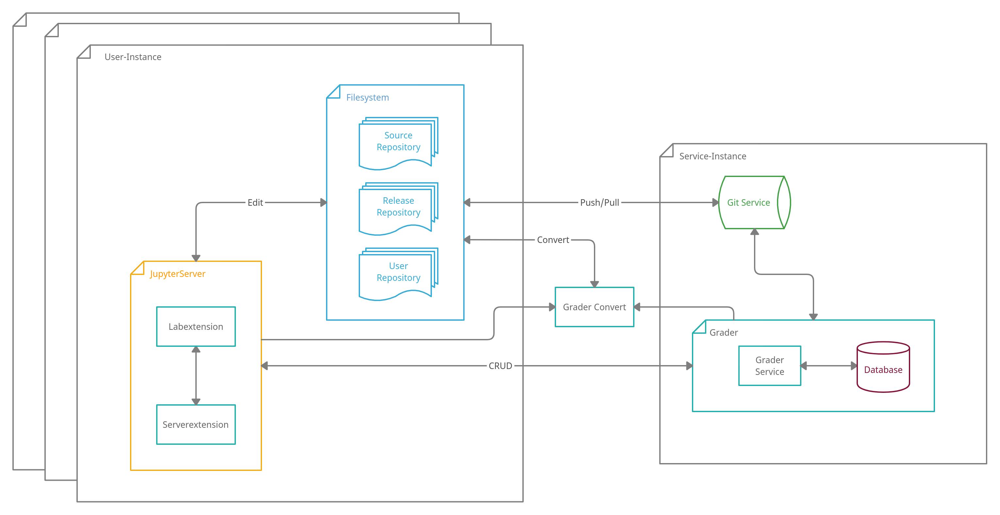

.. grader documentation master file, created by
   sphinx-quickstart on Thu May  5 12:06:00 2022.
   You can adapt this file completely to your liking, but it should at least
   contain the root `toctree` directive.

Grader Service Documentation
#############################

Grader Service offers lecturers and students a well integrated teaching environment for data science, machine learning and programming classes.

.. image:: ./_static/assets/gifs/labextension_update.gif

Contents
==========

.. toctree::
   :maxdepth: 2

   installation
   get_started
   user_guide
   grader_service/grader_service_rest_api
   about

Structure
===========

The application consists of three main components.

* **Grader Service** provides REST endpoints to create, read, update, delete and grade assignments. It also integrates a git service from which lecturers can pull and push to collaborate on the assignment creation and store student submissions.
* **Grader Labextension** implements a front-end view for students, tutors and instructors as well as a server extension that functions as a middleware between frontend and backend. Users can access the complete functionality of the grader service through the widgets and input extensions. Additionally it handles the local file system and repositories on the spawned JupyterHub servers to create, delete, pull and push files or directories.
* **Grader Convert** implements the generation of gradable notebooks, automatic grading of said notebooks and creation of feedback files and is a dependency of both the service and the extension.

Indices and tables
===================

* :ref:`genindex`
* :ref:`modindex`
* :ref:`search`
