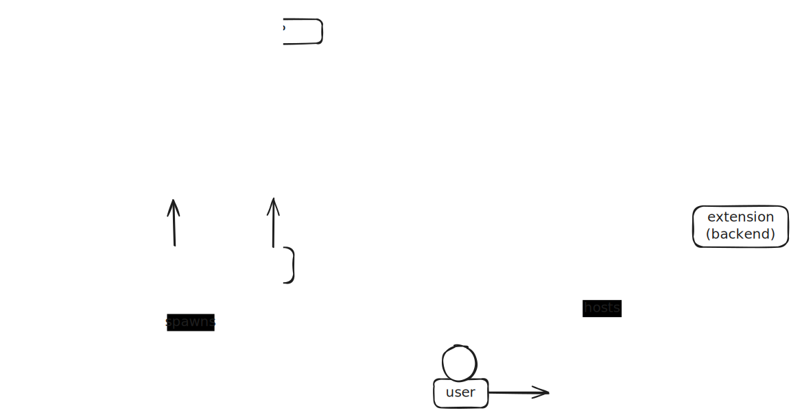

# System Architecture

This documentation provides an overview of the architecture and the various components of the system.

First off: the JupyterLab extension (browser) and the extension (backend) are part of the Grader-Labextension repository. 
However, they are tightly integrated, and it makes sense to show them alongside the Grader-Service architecture.

The following sections will cover all components shown in the overview and discuss their interactions with other components.

## JupyterLab Extension (Browser)

The JupyterLab extension running in the browser allows users to interact with the grading system directly from the JupyterLab interface. 
It communicates with the backend extension hosted on the notebook server, sending requests and retrieving responses. 
The extension serves as the user interface for interacting with the Grader Service, which uses both the core JupyterLab 
API and additional endpoints provided by the backend extension. The authentication between the frontend and backend is 
automatically handled by the Jupyter environment.

## Notebook Server and Extension (Backend)

The backend extension runs on the notebook server as a JupyterLab plugin. It provides API endpoints for the JupyterLab extension (browser) 
and acts as a bridge/relay to the grader services. The backend extension facilitates communication between 
the Grader Service and Jupyter services via API calls. It is responsible for relaying user requests to the Grader Service, 
handling authentication tokens, and managing the connection between the user's environment and the grading infrastructure.

The notebook server hosts the JupyterLab server along with the backend extension. It is spawned by JupyterHub upon 
user login and provides an authenticated environment for running Jupyter notebooks. The server extension ensures that 
all requests from users are authorized using token authentication before being relayed to the Grader Service.

## JupyterHub

JupyterHub manages user authentication and spawns notebook servers. It uses OAuth for authenticating users with the Identity Provider (IDP) 
and ensures that each authenticated user receives a separate, isolated notebook server environment. JupyterHub acts as the gateway 
for users to access the system i.e. users will access the system first through JuptyerHub, which will first authenticate them and then spawn the notebook servers.

## Grader Service

The Grader Service is the primary backend service responsible for managing grading workflows. It consists of various components such as Celery workers, 
API endpoints, and a Git server. The Grader Service processes requests received from the backend extension, runs Git commands to retrieve files, 
queues auto-grading jobs, and returns the responses accordingly.

### Identity Provider (IDP)

The IDP authenticates users from JupyterHub via OAuth. It verifies user identities, issues authentication tokens or cookies for (API) access, 
and retrieves user data. The IDP can load roles from the Grader Service configuration file or update the database directly through post-authentication hooks, 
often integrating with external authentication providers like LTI.

LTI represents a special case where the authentication flow is inverted: authentication starts from an LMS, passing through 
the Grader Service to obtain relevant authentication data before a user can access JupyterHub. This differs from OAuth, 
where the Grader Service can directly relay authentication requests to the OAuth provider when users attempt to authenticate from JupyterHub.

### API

The API component of the Grader Service provides an interface for communication between the backend extension and the grading system. 
It exposes endpoints for submitting grading tasks or retrieving various objects (e.g., lectures or assignments).

### Git Server

The Git server provides endpoints to serve as Git remotes and is responsible for storing and managing grading-related code like 
assignment sources, release versions of assignments, student submission, and feedback files in separate repositories. 
The Git server facilitates file management in the Grader Service, supporting file retrieval and submission.

By integrating Git into the Grader Service, we can leverage its collaborative features, for example, enabling multiple instructors to work together on creating assignments.

### Celery

Celery manages background tasks within the Grader Service. It integrates with the RabbitMQ broker to queue and distribute auto-grading tasks to workers. 
Celery handles tasks asynchronously, enabling scalable and efficient grading workflows.

## RabbitMQ Broker

The RabbitMQ broker is a message queue that facilitates communication between the Grader Service and the auto-grading workers. 
It ensures that tasks are distributed to the appropriate worker processes for execution. The broker queues tasks from 
Celery and delegates them to workers for processing.

## Database

The database stores information related to grading tasks, user submissions, and results. It acts as a persistent data store, 
tracking the state of various grading operations and user interactions with the system.

## File System

The file system is used to store temporary files and artifacts needed for grading (e.g., student submissions) or 
generated during grading (e.g., `gradebook.json` files that store grading information and are subsequently stored in the database). 
It also holds the bare repositories used by the Git server.

## Auto-Grading Jobs

Auto-grading jobs are individual tasks responsible for executing grading processes. These jobs are initiated by the Grader Service workers 
and handle the evaluation of user submissions, such as running notebooks for grading and transforming `.ipynb` files to HTML to generate feedback.

Auto-grading is accomplished using the `grader_service.convert` submodule, which can be executed as a command-line interface (CLI). 
Different executors are available to manage this:
- **LocalAutogradeExecutor**: Executes the module directly within the current Python process on the worker by importing the package and invoking the converters.
- **LocalProcessAutogradeExecutor**: Runs the submodule in a separate process.
- **KubeAutogradeExecutor**: Spawns a Kubernetes pod to run the submodule. This is the only approach that allows different images for lectures, as the grading code must be executed in the same environment as the lecture.

## Grader Service Worker(s)

Grader Service workers are processes that execute auto-grading jobs. They handle tasks delegated by the RabbitMQ broker, 
perform grading, and report the results back to the Grader Service by updating the database and pushing results to the relevant repositories. 
The workers enable parallel processing of multiple grading tasks, thereby improving system throughput. 
These workers are created using Celery with the `worker` argument, which configures them to 
perform the tasks described above.
