User Guide
***************

After installation and configuration of the grader labextension and service you should
be able to access the frontend interface of the extension.
The labextension consists of two launchers.
The assignment launcher opens a window where students can pull and submit their
given assignments.
The course management launcher opens a dashboard
for instructors where you can add, edit and delete assignments.
The course management launcher is only visible if the current user is at least
a tutor in one lecture.

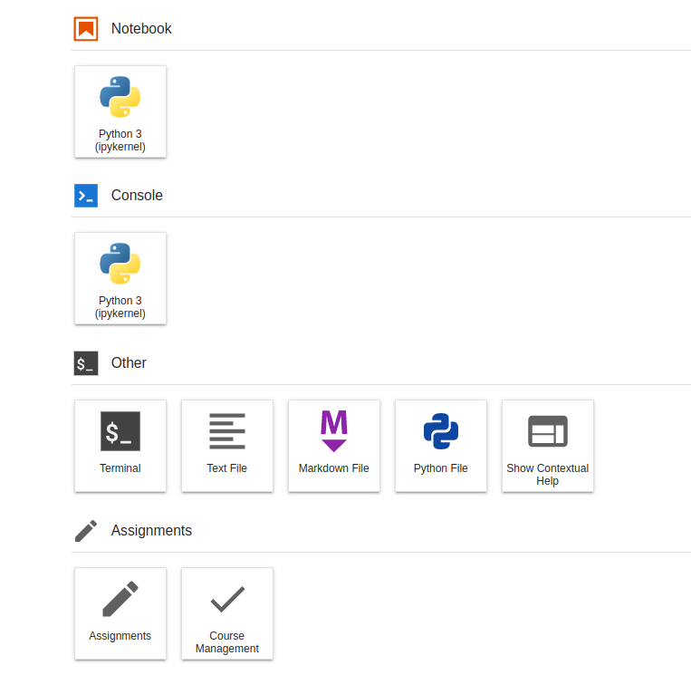

.. note::
    If you do not see the launcher items, it may be the case that extensions might be disabled in JupyterLab.
    You can find how to enable extensions `here <https://jupyterlab.readthedocs.io/en/stable/user/extensions.html#managing-extensions-using-the-extension-manager>`_.
    Another reason might be that the grader service is not running. However, there will be a warning if this is the case.

Create Your First Assignment
=============================
Before students can access the notebooks, an assignment must be created.
To access this feature, open the course management dashboard:

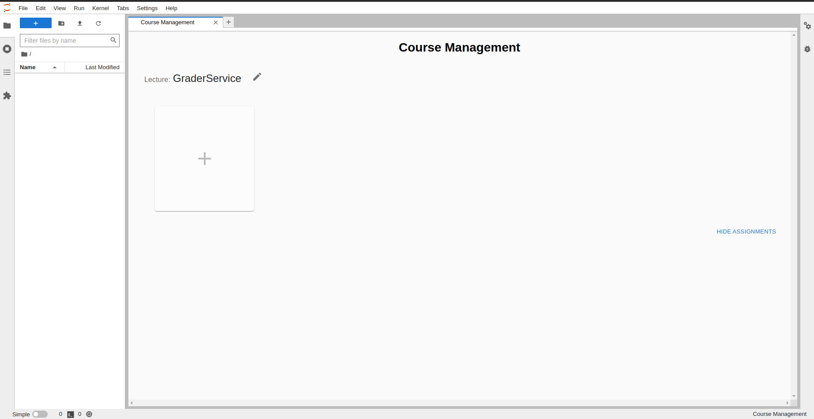

The course management dashboard lists all lectures and their assignments if the current user is an instructor.
By pressing on the "+" field below the lecture name, instructors can
add new assignments to the lecture:

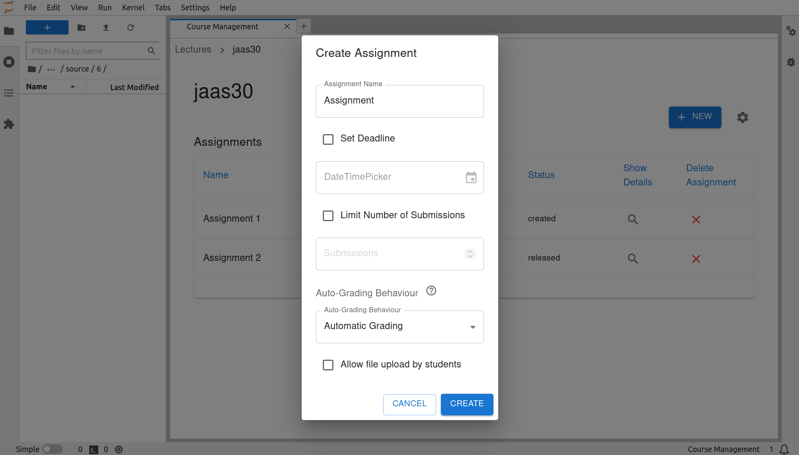

Working With Assignments
========================
Once an assignment has been created it can be opened, which will display the overview window.
In the overview window of the assignment, you will find many ways to monitor, grade and extend the current assignment.

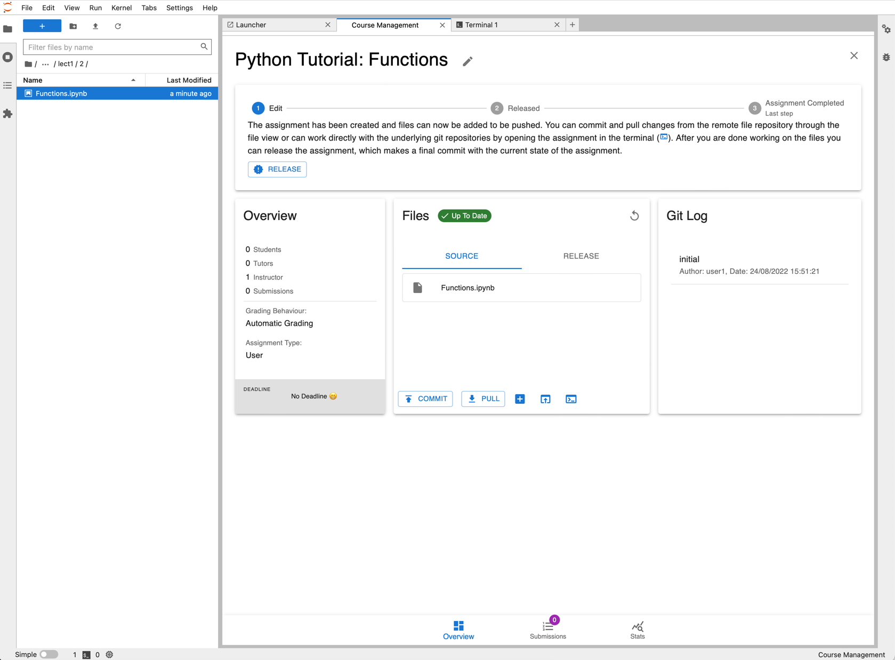

Files
--------------------

Every assignment includes two crucial directories.
The **source directory** contains the source notebooks which instructors create for their assignment.
The **release directory** contains the release versions of the notebooks, which are the converted source notebooks and is used as a preview of what the student version of the notebook looks.
To view these directories, use the files card in the overview window of the assignment.
By switching between source and release file viewer, the extension will convert the source notebooks to their release versions.

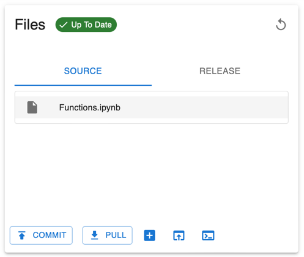

.. note::
    Just the source notebooks and files should be edited! Changes to files in the release directory will be lost when generating the files again.

The grader service and labextension use git to support the collaborative creation of assignments. Also, it provides a simple way to distribute the files to the students.
Notebooks can be added by either using the "Create a new notebook" button or by copying files directly into the correct source directory via the file browser.

The source directory can also be revealed in the JupyterLab file browser or be opened in a terminal window.

Creating a Notebook for an Assignment
=====================================

Up until now, no files have been added to the assignment. To have tasks for students to work on, notebooks have to be added to the assignment.
As mentioned previously, we can either add a notebook from the file view or create it using the JupyterLab launcher.

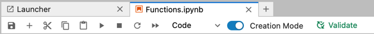

For notebooks which are in the source directory, a creation mode can be enabled in the notebook toolbar.
It adds widgets around notebook cells that can be used to control the function of the code cell.

Grader Cell Types:

- Readonly
    This cell is locked and editing is disabled.
- Autograded answer
    This cell contains the code for the solution of a task.
    It has to be surrounded by  ``BEGIN SOLUTION`` and ``END SOLUTION`` directives as comments around the actual solution code.
    Due to the directives, the code will be replaced by placeholder code such as ``raise NotImplementedError()``.
    Also, a hint can be given to students and solutions can be commented while grading.

    .. image:: _static/assets/images/autograded_answer.png
        :width: 500
        :alt: autograded answer
        :align: center

    .. warning::
        If the ``BEGIN SOLUTION`` and ``END SOLUTION`` directives are omitted, the solution code will end up in the released files!

- Autograded tests
    This cell contains the test cases to test the auto-graded answer given by students.
    These may be ``assert`` statements that check the implemented code.
    Invalid solutions have to lead to an exception.

    .. note::
        Part or all of the tests can be hidden with ``BEGIN HIDDEN TESTS`` and ``END HIDDEN TESTS`` directives.

    .. image:: _static/assets/images/autograded_test.png
        :width: 500
        :alt: autograded test
        :align: center

- Manual graded answer
    This cell type supports free-form answers from students.
    They should not be tested with automatic tests but are intended to be manually graded.
    The cells can be configured to either be code or markdown cells, so students can either implement code or answer in text.

    .. image:: _static/assets/images/manual_answer.png
        :width: 500
        :alt: manual answer
        :align: center

- Manual graded task
    This cell type represents an abstract task description.
    It is intended for a general description of what should be done and students are free to implement the task however they see fit where the answer could span several cells.
    The task can only be given in a markdown cell.

Assignment Lifecycle
=====================================

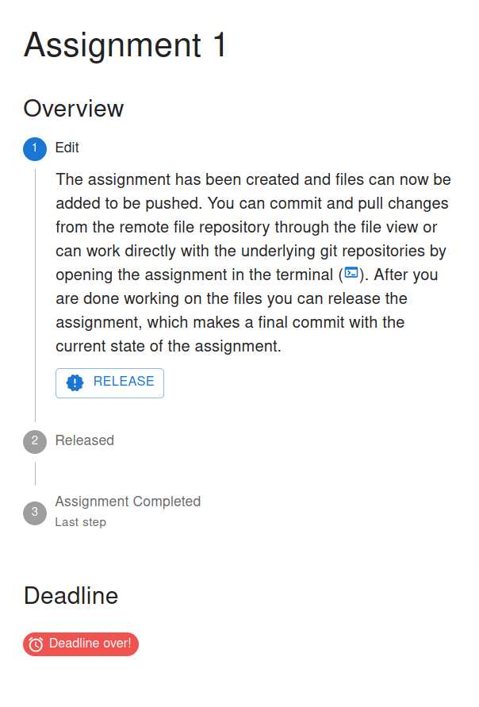

An assignment can have 3 states that can be switched between and represent the lifecycle of the assignment.

- Edit
    When first created, the assignment is in "Edit mode", where the assignment files can be added and edited.
    In this stage, the assignment is not visible to students. However, when an instructor opens the student window, it will be displayed to them.
- Released
    The assignment is released to students and the students can work on it.
    The released files are identical to the files in the release directory at the time of the release.
    It is possible to undo the release and publish a new release. However, some students may have already pulled the old release.
    In this case the students might have to reset their files and might loose progress, which has to be communicated.
    In general, a re-release should be avoided.

    .. warning::
        Revoking a released assignment may lead to diverging states of student files and submissions that fail auto-grading.

- Completed
    The assignment is over and cannot be worked on anymore and new submissions will be rejected, but it is still visible.
    This state can be revoked without any consideration and will return to a released state.

Grading Assignments
=====================================

Student submissions can be graded when switching to the Submissions tab at the bottom of the overview window.

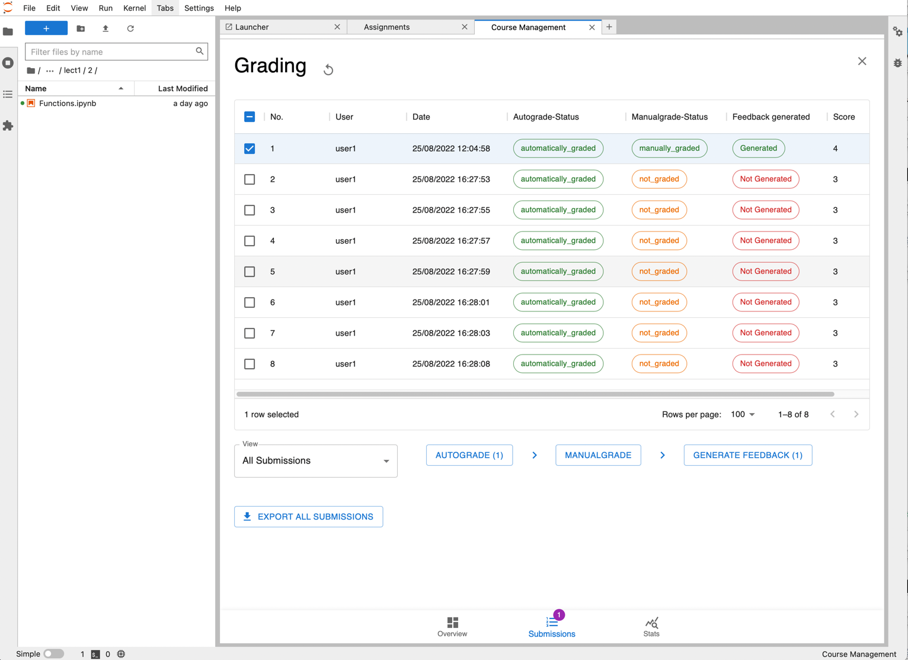

Submissions can be selected from the list and actions can be performed on the submissions.
Grader Service supports batch auto-grading and batch feedback generation of several submissions.
Naturally, submissions have to be manually graded individually.

Generally, submissions have to be auto-graded first before anything else can be done.
If manual grading is not needed or not wanted, it can be skipped.
The last step is feedback generation, at which point students will see their results.

Auto-Grading Behavior
-----------------------

In the edit and creation menu for an assignment, it is possible to select the auto-grading behavior for the assignment.
It specifies the action taken when a user submits an assignment.

- No Automatic Grading
    No action is taken when users submit the assignment.
- Automatic Grading (Recommended)
    The assignment is being auto-graded as soon as the user submits the assignment.
    This means that submissions in the grading view are always auto-graded.
- Fully Automatic Grading
    The assignment is auto-graded and feedback is generated as soon as the student submits their assignment.
    This requires that no manually graded cells are part of the assignment.

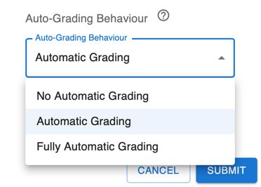

Student Guide
=====================================

Students are presented with a list of assignments for them to solve.
The card of an assignment provides an overview of the assignment, such as the number of submissions, whether feedback for one submission is available and the maximum points reached in a submission.
It also shows a countdown of the deadline.

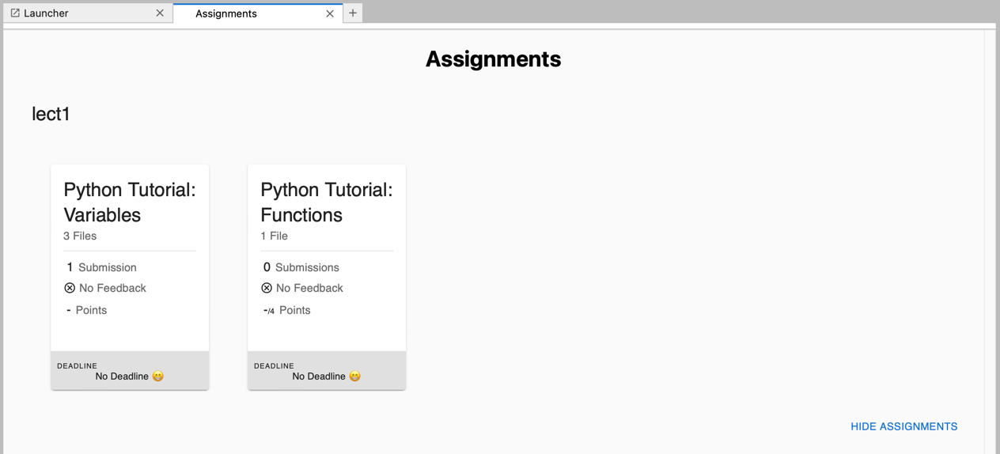

When clicking on an assignment card, students are presented with a detailed view of the assignment that lets them work on the assignment and make submissions.

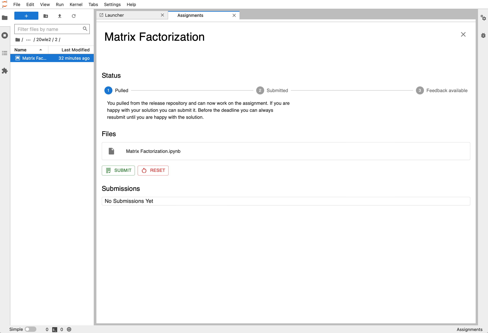

The status bar is supposed to guide the students through the stages, from working on the assignment to viewing the feedback they received.

The files in the assignment are displayed in a list and can be opened from there. The submit button submits the current state of the assignment.
To reset the assignment to its original state, students can use the reset button.
No progress is lost when resetting the assignment, the release state is just a new commit in the underlying git repository.

Submissions are shown in the submission list. If a submission has feedback available, it will be displayed in this submission list and can be viewed from there.

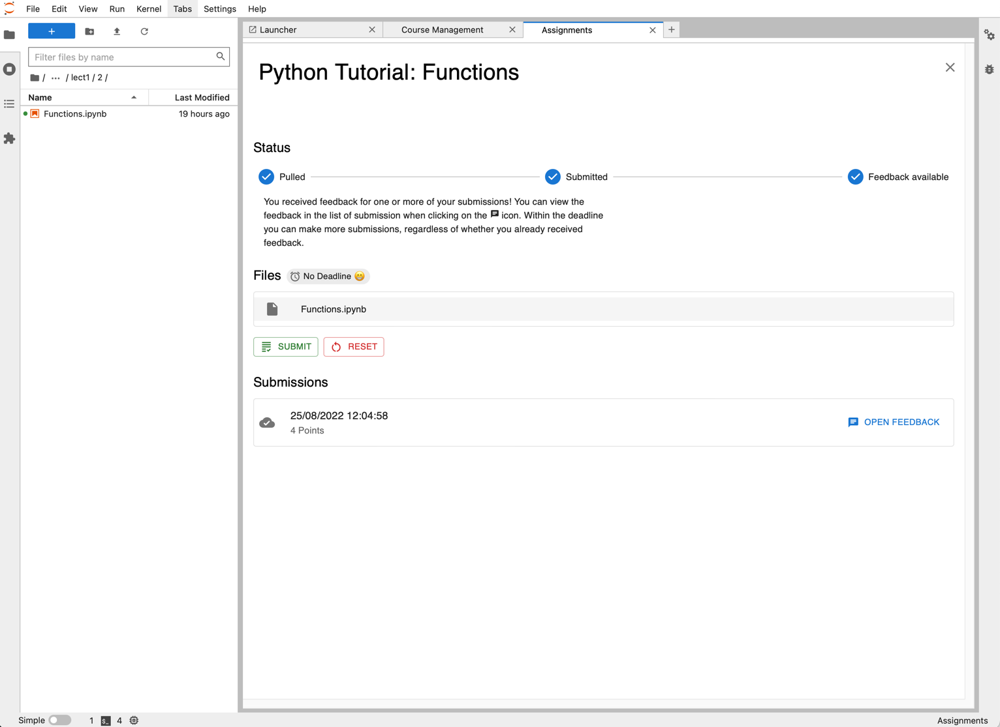

Once the student submissions have been graded and feedback is available we can see it in the submission list and can open the feedback view.
It will present an overview of the score reached and a list of detailed feedback for each graded notebook.

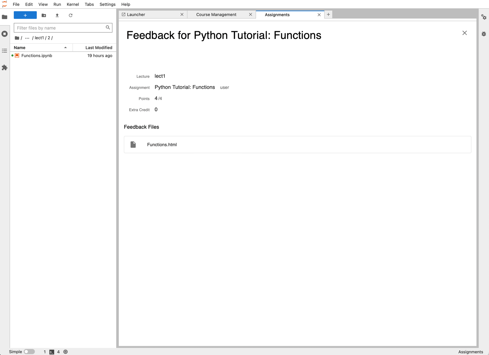

The detailed feedback is a HTML file and shows the student answers along with the score and comments from instructors.

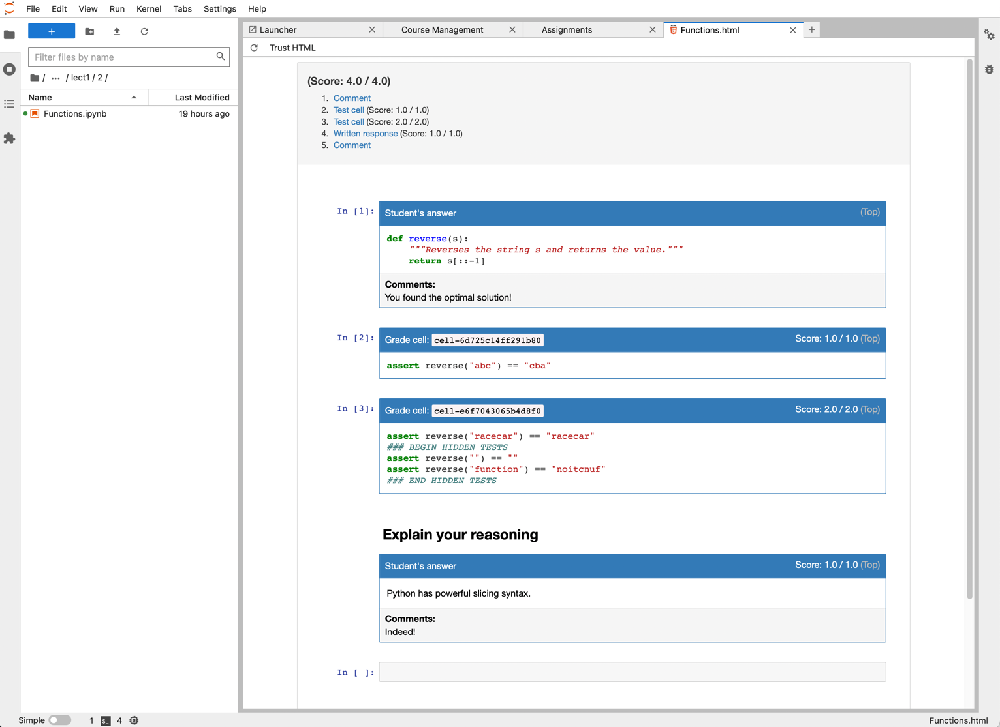

.. note::
    You may have to click the "Trust HTML" button to view the feedback file.

